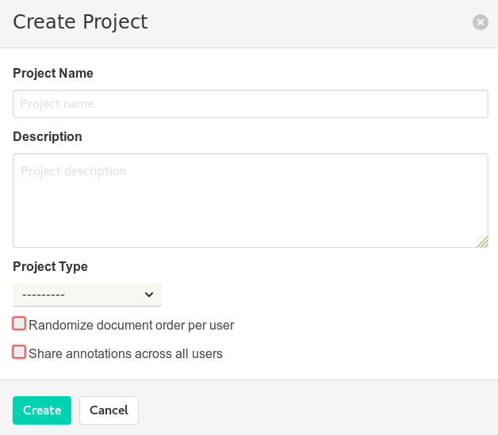

Questo documento @@@

# Strumenti

Oltre al software *doccano*, preinstallato e disponibile [a questo link](), è consigliato l'utilizzo di un editor di testo. Per Windows è consigliato l'uso di `Notepad++`, editor gratuito [disponibile qui](https://notepad-plus-plus.org/downloads/); per Mac è invece consigliato @@@

# Accesso

Una volta aperta la [pagina della piattaforma](), cliccare su `Login`, inserire i dati forniti - `Username` e `Password` e cliccare sul pulsante `Login`; il sito vi reindirizzerà all'elenco dei progetti disponibili. Una volta effettuato l'accesso, sarà possibile effettuare le seguenti operazioni:

- Creare un nuovo progetto e popolarlo con testi.
- Aggiungere nuovi testi ad un progetto già esistente.
- Annotare i testi caricati all'interno di un progetto.
- Creare o modificare le etichette per l'annotazione.

Nelle sezioni a seguire vengono descritte le 4 sopracitate operazioni.

> :warning: L'elenco dei progetti visibili varia da utente ad utente! Ogni utente potrà visualizzare (ed accedere a) solamente i progetti ai quali è stato autorizzato!  

# Creare un nuovo progetto

Nella pagina dei progetti, raggiungibile cliccando su `Projects` nella barra in alto a destra, cliccando su `Create Project` è possibile creare un nuovo progetto. Apparirà la seguente finestra:

# Caricamento nuovi dati

È possibile caricare nuovi testi all'interno della piattaforma ed includerli o come un **nuovo dataset** oppure @@@. In entrambe i casi, il formato dei documenti è lo stesso, e viene descritto più sotto (sez. @@@.)

## Importare nuovi testi

### Preparazione dei testi

> :warning: Per importare nuovi testi, è necessario che questi siano formattati in **file di testo semplice** (estensione `.txt`), dove **ogni riga contiene un diverso testo**.

Ad esempio: decidiamo di importare una serie articoli di Umberto Eco (scritti per *La Bustina di Minerva*). Individuati gli articoli che ci interessano, per ogni articolo copiamo (<kbd>CTRL</kbd> + <kbd>c</kbd>) ed incolliamo (<kbd>CTRL</kbd> + <kbd>v</kbd>) il *titolo*, il *sottotitolo*, ed il *corpo* nell'editor di testo. Otterremo un testo simile a quanto mostrato di seguito (per motivi di spazio, ho incluso solo il primo paragrafo di [questo articolo](https://espresso.repubblica.it/opinioni/la-bustina-di-minerva/2015/12/22/news/la-civil-conversazione-1.244548), dove il titolo è marcato in grassetto, il sottotitolo in corsivo, ed il corpo non è marcato:

**La civil conversazione**  
*La trasmissione francese “Apostrophe” è stata un modello di discussione colta e pacata lontanissima dai talk-show sguaiati. In Italia niente di simile*  
“Le Magazine Littéraire” ha dedicato un supplemento alla rievocazione di “Apostrophe”, la celebre trasmissione condotta da Bernard Pivot tra il 1975 e il 1990, e che ha rappresentato un fenomeno abbastanza unico nella storia di quelli che abitualmente si chiamano “talk shows”. “Apostrophe” andava in onda in prima serata e, siccome vi ho partecipato varie volte, ricordo un episodio abbastanza significativo. Una mattina dopo la trasmissione, entrato in un bar per prendere un caffè, il barista non ha voluto essere pagato. Questo significa semplicemente che un barista (non un intellettuale che vive tra i libri) si metteva in prima serata a seguire una trasmissione dedicata esclusivamente ai libri. E credo che questo fosse dovuto al fascino e alla capacità comunicativa di Pivot.

A questo punto ci sono 2 operazioni da portare avanti:

- [x] **Trasformare gli *a capo* in semplici spazi**, in modo che tutto il testo dell'articolo occupi una sola riga.
- [x] (opzionale) **Includere il *titolo* e il *sottotitolo* all'interno di un tag**, identificato dai simboli *minore*  <kbd><</kbd> e *maggiore*  <kbd>></kbd>.

Il risultato finale apparirà simile a quanto riportato sotto:

> <La civil conversazione La trasmissione francese “Apostrophe” è stata un modello di discussione colta e pacata lontanissima dai talk-show sguaiati. In Italia niente di simile> “Le Magazine Littéraire” ha dedicato un supplemento alla rievocazione di “Apostrophe”, la celebre trasmissione condotta da Bernard Pivot tra il 1975 e il 1990, e che ha rappresentato un fenomeno abbastanza unico nella storia di quelli che abitualmente si chiamano “talk shows”. “Apostrophe” andava in onda in prima serata e, siccome vi ho partecipato varie volte, ricordo un episodio abbastanza significativo. Una mattina dopo la trasmissione, entrato in un bar per prendere un caffè, il barista non ha voluto essere pagato. Questo significa semplicemente che un barista (non un intellettuale che vive tra i libri) si metteva in prima serata a seguire una trasmissione dedicata esclusivamente ai libri. E credo che questo fosse dovuto al fascino e alla capacità comunicativa di Pivot.

:heavy_check_mark:  **Suggerimento**: è possibile automatizzare la trasformazione degli *a capo* in *spazi semplici* usando un editor di testo che supporta le espressioni regolari. Nel caso di `Notepad++`

### Creare un nuovo progetto e popolarlo con testi

- Dalla homepage della piattaforma cliccare su `Projects`

- Cliccare sul pulsante `Create Project`

- Impostare un nome per il progetto (`Project Name`); una breve descrizione (`Description`); selezionare il tipo di annotazione da abilitare per il progetto (v. @@@@); selezionare se l'ordine col quale i testi vengono presentati ai diversi utenti deve essere casuale o meno (opzione `Randomize document order per user`); selezionare se le annotazioni sono condivise tra i diversi utenti del progetto o meno (`Share annotations across all users`).

### Aggiungere nuovi testi ad un progetto già esistente

Una seguite le istruzioni per la *Preparazione dei testi*, è possibile importare il file `.txt` contenente tutti i nuovi testi attraverso la funzione `Import Data`.  Ecco un elenco dei passaggi da eseguire:

- [] Aprire la pagina del progetto

- [] Selezionare `Edit Data`

- [] Nella pagina che si apre, selezionare `Import Data`

- [] Tra le tre opzioni presentate (`Plain`, `CoNLL`, e `JSONL`), selezionare `Plain`

- [] Cliccare sul pulsante `Select a file...` e selezionare il file `.txt` precedentemente preparato.

Automaticamente `doccano` aggiungerà i nuovi testi contenuti nel file `.txt` al dataset del progetto.
